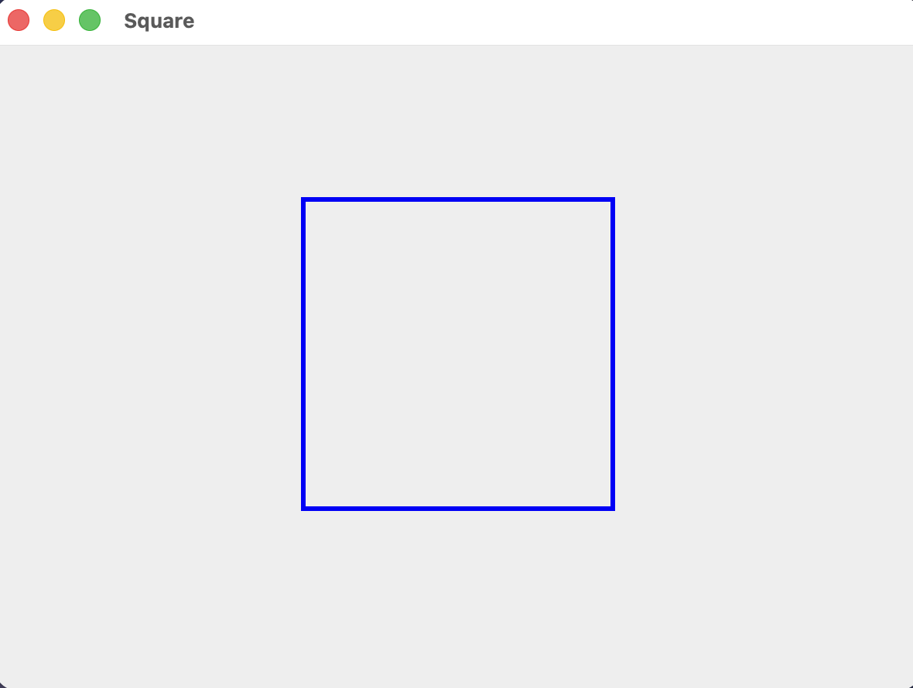

# Square

A small Java Swing project that demonstrates how to draw a square outline with the `Graphics2D` API.

The application opens a `600 × 450` window and renders one square with the following properties:

- **Colour:** blue
- **Style:** outline only
- **Stroke width:** 3 pixels
- **Top-left coordinate:** `(200, 100)`
- **Width:** 200 pixels
- **Height:** 200 pixels

Because the width and height are equal, the rectangle produced by `drawRect` is a square.

The graphical application uses the standard Java Swing and AWT libraries. Apache Maven manages compilation, testing, and packaging, while JUnit is included only for the test source set.

---

## Output

The application displays a blue, three-pixel-wide square outline inside a window titled `Square`:



---

## Project Structure

```text
square/
├── README.md
├── media/
│   └── square.png
├── pom.xml
└── src/
    ├── main/
    │   └── java/
    │       └── com/
    │           └── github/
    │               └── varunkarthic/
    │                   └── App.java
    └── test/
        └── java/
            └── com/
                └── github/
                    └── varunkarthic/
                        └── AppTest.java
```

Maven creates a `target/` directory when the project is built. It contains compiled classes, test reports, and the packaged JAR, so it is generated output rather than source code.

---

## Development Environment

This project was built and tested using:

```text
openjdk version "26.0.2" 2026-07-21
OpenJDK Runtime Environment Homebrew (build 26.0.2)
OpenJDK 64-Bit Server VM Homebrew (build 26.0.2, mixed mode, sharing)

Apache Maven 3.9.16
```

The Maven configuration targets Java 21, so the project requires:

- JDK 21 or newer,
- Apache Maven 3.x,
- a graphical desktop environment that can display a Swing window.

Swing and AWT are part of the JDK and do not need to be installed separately.

Check the active Java and Maven versions with:

```bash
java -version
mvn -version
```

> `mvn -version` is particularly useful because it reports the JDK Maven is actually using.

---

## Build, Test, and Run

Open a terminal and move into the project directory. From the repository root:

```bash
cd code/square
```

All Maven commands in this README should be run from the directory containing `pom.xml`.

### Compile the Application

```bash
mvn clean compile
```

This performs two Maven lifecycle operations:

- `clean` removes the previous `target/` directory.
- `compile` compiles the main Java source into `target/classes`.

A successful build ends with:

```text
BUILD SUCCESS
```

### Run the Tests

```bash
mvn test
```

This compiles the application and test sources, then runs `AppTest` through Maven Surefire.

### Run the Application

After compiling, run the fully qualified main class:

```bash
java -cp target/classes com.github.varunkarthic.App
```

The command has two important parts:

```text
target/classes                → location of Maven's compiled classes
com.github.varunkarthic.App   → package name and public class name
```

The `-cp` option adds `target/classes` to Java's classpath.

### Package the Application

```bash
mvn clean package
```

This compiles the source, runs the tests, and creates:

```text
target/square-1.0-SNAPSHOT.jar
```

Run the packaged application by placing the JAR on the classpath:

```bash
java -cp target/square-1.0-SNAPSHOT.jar com.github.varunkarthic.App
```

> The current `pom.xml` does not add a `Main-Class` entry to the JAR manifest. Use the classpath command above because `java -jar target/square-1.0-SNAPSHOT.jar` does not know which class to launch.

---

# Application — App

`App.java` defines both the custom drawing panel and the application's `main` method.

The application is static:

- there is no mouse or keyboard input,
- there is no animation or timer,
- the square uses fixed pixel coordinates,
- Swing redraws the square whenever the panel needs to be painted.

The component hierarchy is:

```text
JFrame — "Square"
└── App (JPanel)
    └── Blue square outline drawn with Graphics2D
```

---

## 1. Package Declaration

```java
package com.github.varunkarthic;
```

The package places the application in the namespace:

```text
com.github.varunkarthic
```

The directory structure below `src/main/java` matches that package:

```text
src/main/java/com/github/varunkarthic/App.java
              └──────────┬──────────┘
                    package path
```

The package and class name combine to form the fully qualified main class:

```text
com.github.varunkarthic.App
```

---

## 2. Imports

```java
import javax.swing.JFrame;
import javax.swing.JPanel;
import java.awt.Graphics;
import java.awt.Graphics2D;
import java.awt.Color;
import java.awt.BasicStroke;
```

These imports provide the window, drawing surface, and rendering controls used by the program.

- `JFrame` provides the top-level application window.
- `JPanel` provides the surface on which the square is drawn.
- `Graphics` is the drawing context supplied by Swing.
- `Graphics2D` provides additional control over two-dimensional rendering.
- `Color` supplies the predefined `BLUE` colour.
- `BasicStroke` controls the thickness of the square outline.

No third-party graphics libraries are required.

---

## 3. Creating the Drawing Panel

```java
public class App extends JPanel {
```

`App` extends `JPanel`, so an `App` object is also a Swing panel.

Extending `JPanel` allows the class to override the panel's painting method and provide custom drawing instructions.

The public class name and source filename match:

```text
Filename:          App.java
Public class name: App
```

Java requires a public top-level class to have the same name as its source file.

---

## 4. Overriding `paintComponent`

```java
@Override
protected void paintComponent(Graphics g) {
    super.paintComponent(g);
```

Swing calls `paintComponent` when the panel first appears and whenever the panel needs to be redrawn.

The `@Override` annotation tells the compiler that this method replaces the inherited `JPanel` implementation.

The first statement is:

```java
super.paintComponent(g);
```

This lets `JPanel` perform its normal painting work before the custom square is drawn. In particular, it clears the previous panel contents and paints the panel background.

Without this call, old pixels could remain visible after the window is covered, restored, or resized.

The `Graphics` object is supplied by Swing for the current repaint operation. The program does not create it manually.

---

## 5. Converting `Graphics` to `Graphics2D`

```java
Graphics2D g2d = (Graphics2D) g;
```

Swing supplies the drawing context through the more general `Graphics` type.

The object is cast to `Graphics2D` so the program can use advanced two-dimensional rendering settings. In this application, that additional control is used to select a custom stroke width.

`Graphics2D` also supports features such as:

- rendering hints,
- transformations,
- rotation and scaling,
- composite operations,
- custom stroke styles.

Only colour, stroke, and rectangle drawing are needed for the current square.

---

## 6. Java's Drawing Coordinate System

Coordinates are measured in pixels relative to the drawing panel.

Java's component coordinate system begins at the top-left corner:

```text
(0,0) ─────────────────────────────→ +X
  |
  |
  |
  |
  ↓
 +Y
```

Therefore:

- increasing `X` moves a point to the right,
- decreasing `X` moves a point to the left,
- increasing `Y` moves a point downward,
- decreasing `Y` moves a point upward.

The square begins at:

```text
(x, y) = (200, 100)
```

This is the top-left corner of the square's bounding rectangle.

---

## 7. Selecting the Square Colour

```java
g2d.setColor(Color.BLUE);
```

`setColor` changes the current drawing colour to blue.

Every later drawing operation uses this colour until another call to `setColor` changes it.

In this application, the only drawing operation after the colour selection is the square outline, so the complete outline is blue.

---

## 8. Setting the Outline Width

```java
g2d.setStroke(new BasicStroke(3));
```

`BasicStroke` controls how `Graphics2D` renders lines and shape boundaries.

The value `3` requests a stroke that is three pixels wide:

```text
Outline width = 3 pixels
```

The stroke remains active until another stroke is selected or the current repaint operation ends.

Stroke settings affect outline operations such as `drawRect`. They do not determine the interior colour because the square is not filled.

---

## 9. Drawing the Square

```java
g2d.drawRect(200, 100, 200, 200);
```

The `drawRect` method uses this parameter order:

```text
drawRect(x, y, width, height)
```

The values used by the application are:

```text
x      = 200 pixels
y      = 100 pixels
width  = 200 pixels
height = 200 pixels
```

### Position

The first two arguments define the top-left corner:

```text
Top-left = (200, 100)
```

The nominal corner coordinates are:

```text
Top-left     = (200, 100)
Top-right    = (400, 100)
Bottom-left  = (200, 300)
Bottom-right = (400, 300)
```

They are calculated as:

```text
Right edge  = x + width  = 200 + 200 = 400
Bottom edge = y + height = 100 + 200 = 300
```

### Why It Is a Square

A rectangle becomes a square when its width and height are equal:

```text
width = height
200   = 200
```

Each side therefore has a nominal length of 200 pixels.

### Outline Instead of Fill

`drawRect` renders only the boundary:

```text
               200 pixels
        (200,100)────────────(400,100)
             │                  │
             │                  │
             │                  │ 200 pixels
             │                  │
        (200,300)────────────(400,300)
```

The square's interior remains the panel's background colour.

To draw a filled square instead, the application would use:

```java
g2d.fillRect(200, 100, 200, 200);
```

---

## 10. Understanding Graphics State

The `Graphics2D` object keeps its current rendering settings throughout one call to `paintComponent`.

The current drawing sequence is:

```text
Receive Graphics context from Swing
              ↓
Convert it to Graphics2D
              ↓
Set current colour to BLUE
              ↓
Set current stroke to 3 pixels
              ↓
Draw the 200 × 200 square outline
```

The ordering is important:

- the colour is selected before the square is drawn,
- the stroke is selected before the square is drawn,
- `drawRect` uses both active settings,
- no later drawing call changes or covers the square.

The current code does not explicitly enable anti-aliasing. Rendering therefore uses the default rendering hints supplied by the graphics environment.

---

## 11. Creating the Application Window

```java
public static void main(String[] args) {
    JFrame frame = new JFrame("Square");
    App panel = new App();

    frame.add(panel);
    frame.setSize(600, 450);
    frame.setDefaultCloseOperation(JFrame.EXIT_ON_CLOSE);
    frame.setLocationRelativeTo(null);
    frame.setVisible(true);
}
```

The `main` method is the application entry point.

### Creating the Frame

```java
JFrame frame = new JFrame("Square");
```

creates the top-level window and sets its title to:

```text
Square
```

### Creating the Custom Panel

```java
App panel = new App();
```

creates an instance of the custom `JPanel` subclass that contains the square-rendering logic.

### Adding the Panel

```java
frame.add(panel);
```

places the drawing panel inside the frame. With the frame's default border layout, the panel expands to occupy the available content area.

### Setting the Initial Window Size

```java
frame.setSize(600, 450);
```

sets the frame's initial outer dimensions to `600 × 450` pixels.

The drawable content area can be slightly smaller because the title bar and window borders occupy part of the frame's outer size.

### Setting the Closing Behaviour

```java
frame.setDefaultCloseOperation(JFrame.EXIT_ON_CLOSE);
```

terminates the Java process when the user closes the window.

Without this setting, closing the visible frame might leave the application running in the background.

### Centring the Window

```java
frame.setLocationRelativeTo(null);
```

places the window near the centre of the current screen.

This centres the window itself; it does not calculate or change the square's coordinates.

### Displaying the Window

```java
frame.setVisible(true);
```

makes the configured frame visible and allows Swing to begin its normal rendering process.

---

## Application Logic Summary

The complete application flow can be simplified to:

```text
Start App.main()
       ↓
Create JFrame titled "Square"
       ↓
Create the App drawing panel
       ↓
Add the panel to the frame
       ↓
Set the frame to 600 × 450
       ↓
Configure closing behaviour
       ↓
Centre and display the frame
       ↓
Swing calls App.paintComponent(Graphics)
       ↓
Clear the panel through super.paintComponent(g)
       ↓
Convert Graphics to Graphics2D
       ↓
Select blue and a 3-pixel stroke
       ↓
Draw the 200 × 200 square at (200, 100)
       ↓
Display the completed panel
```

The square is not a separate Swing component. It is a set of pixels rendered by executing the instructions in `paintComponent` whenever Swing repaints the panel.

---

# Maven Configuration

Maven provides a standard source layout and automates the build lifecycle.

---

## 1. Project Coordinates

```xml
<groupId>com.github.varunkarthic</groupId>
<artifactId>square</artifactId>
<version>1.0-SNAPSHOT</version>
```

Together, these values identify the Maven project as:

```text
com.github.varunkarthic:square:1.0-SNAPSHOT
```

- `groupId` identifies the organisation or namespace.
- `artifactId` identifies this project as `square`.
- `version` identifies the current development version.
- `SNAPSHOT` indicates a development build rather than a fixed release.

The artifact ID and version determine the packaged filename:

```text
square-1.0-SNAPSHOT.jar
```

---

## 2. Project Name and Description

```xml
<name>square</name>
<description>A Java Swing application that draws a blue square outline.</description>
```

These fields provide human-readable Maven metadata.

They do not change the Java package or main class. The application still starts through:

```text
com.github.varunkarthic.App
```

---

## 3. Java Version and Source Encoding

```xml
<maven.compiler.release>21</maven.compiler.release>
<project.build.sourceEncoding>UTF-8</project.build.sourceEncoding>
```

`maven.compiler.release` tells Maven to compile the project for Java 21.

Using `release` configures the Java language level, compiler API, and target bytecode consistently.

`project.build.sourceEncoding` tells Maven to read the source files as UTF-8.

---


## 4. Maven Build Lifecycle

The configured Maven plugins handle the main build phases:

- Maven Clean Plugin removes generated output.
- Maven Resources Plugin processes project resources.
- Maven Compiler Plugin compiles application and test code.
- Maven Surefire Plugin runs unit tests.
- Maven JAR Plugin packages compiled classes.

A typical build moves through:

```text
validate
   ↓
compile
   ↓
test
   ↓
package
```

Running a later phase automatically runs the required earlier phases. For example:

```bash
mvn package
```

compiles the application, compiles the tests, runs the tests, and creates the JAR.

---

## 5. Generated Build Output

After compilation and testing, the generated structure is approximately:

```text
target/
├── classes/
│   └── com/github/varunkarthic/App.class
├── test-classes/
│   └── com/github/varunkarthic/AppTest.class
└── surefire-reports/
    └── test result files
```

After packaging, Maven also creates:

```text
target/square-1.0-SNAPSHOT.jar
```

Because `target/` is generated, it can be recreated with Maven and should not be edited manually.

---

# Customising the Square

The square is controlled by the colour, stroke, and arguments passed to `drawRect`.

---

## Change the Colour

Select another `Color` value before drawing:

```java
g2d.setColor(Color.RED);
```

This would render a red outline instead of a blue one.

---

## Change the Outline Width

Create a different `BasicStroke`:

```java
g2d.setStroke(new BasicStroke(5));
```

This example requests a five-pixel-wide outline.

---


