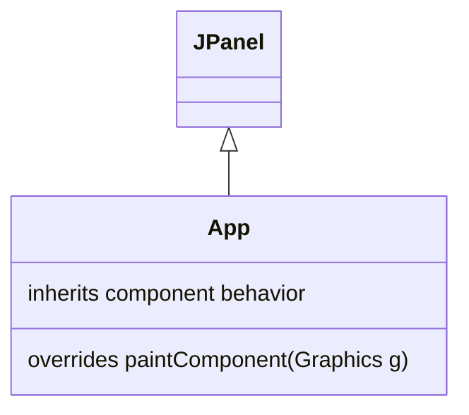
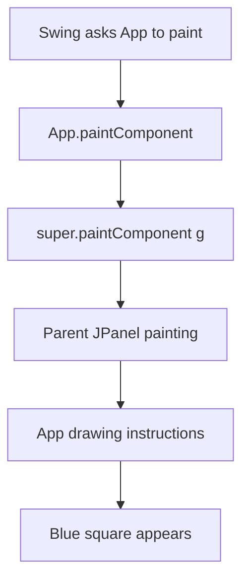

# Understanding Java Inheritance and Drawing Primitive Shapes
*Thursday, 20 August 2026*

## Class Context

In this class, we analysed the Java Swing program created to draw a square. The purpose was to understand both the Java structure of the program and the graphics concepts behind the drawing. While examining the square code, we connected `JPanel`, inheritance, method overriding, `super`, and the use of lines and rectangles to construct shapes.

The program extends `JPanel` and overrides `paintComponent`. This means that the class is not only responsible for drawing the square; it is also participating in Swing's component hierarchy and replacing a parent-class method with its own drawing behavior.

## Java Classes, Subclasses, and Instances

A Java **class** is a definition that describes the data and behavior of an object. An **instance** is an object created from that class. For example, `JPanel` is a class provided by Swing, while `App` is the class created for this project.

The declaration below makes `App` a subclass of `JPanel`:

```java
public class App extends JPanel {
    // App inherits JPanel behavior and can add its own behavior.
}
```

The relationship can be represented as:



Because `App` extends `JPanel`, an `App` object can be used wherever a `JPanel` is expected. The object is created in `main`:

```java
App panel = new App();
frame.add(panel);
```

Here, `new App()` creates an instance of the `App` class. The instance is stored in the variable `panel` and then added to the `JFrame` as a Swing component.

## Method Overriding and `@Override`

**Method overriding** occurs when a subclass supplies its own implementation of a method that already exists in its parent class. `JPanel` already has a `paintComponent` method, but `App` provides a version that performs the drawing required by this application.

```java
@Override
protected void paintComponent(Graphics g) {
    super.paintComponent(g);
    // Drawing instructions are added here.
}
```

The `@Override` annotation tells the compiler and the reader that this method is intended to override a parent method. It also helps detect mistakes such as using the wrong method name, parameters, or return type. In this case, the method is called by Swing when the panel needs to be painted or repainted.

The access level remains `protected` because the overridden method in `JPanel` is protected. The method receives a `Graphics` object, which provides the drawing surface and graphics operations supplied by Swing.

## Calling the Parent Implementation with `super`

The keyword `super` refers to the immediate parent portion of the current object. Therefore:

```java
super.paintComponent(g);
```

calls the original `paintComponent` implementation inherited from `JPanel`.

The overridden method can be understood as a two-stage process:



Calling the parent implementation first allows Swing to perform its normal component-painting work, including preparing the component background. The subclass then adds its own drawing. Omitting this call can leave old pixels or visual artefacts when the component is repainted, especially after being uncovered, resized, or refreshed.

## Lines, Rectangles, and Triangles

Computer graphics programs construct many shapes from simple geometric primitives. A **line** is defined by two points, a rectangle by a position and two dimensions, and a triangle by three vertices connected by three line segments.

For two points $P_1=(x_1,y_1)$ and $P_2=(x_2,y_2)$, a line segment can be described by its endpoints. Its length is:

$$
d = \sqrt{(x_2-x_1)^2 + (y_2-y_1)^2}
$$

A rectangle can be specified by its top-left corner and its width and height:

```text
(x, y) +------------------+
        |                  |
        |     rectangle    | height
        |                  |
        +------------------+
             width
```

In the square program, the call is:

```java
g2d.drawRect(200, 100, 200, 200);
```

The arguments represent:

- `200` → left `x` coordinate;
- `100` → top `y` coordinate;
- `200` → width;
- `200` → height.

Since the width and height are equal, the rectangle is a square. The square is an outline because `drawRect` draws its boundary rather than filling its interior.

A triangle is represented by three points:

```text
             P1
            /  \
           /    \
          /      \
        P2--------P3
```

Its boundary consists of the segments $P_1P_2$, $P_2P_3$, and $P_3P_1$. A triangle can therefore be drawn by drawing three lines or by using a polygon API with three vertices.

## Boundary Method for Generating a Triangle

The boundary method generates a shape by identifying points along its edges and drawing or colouring those boundary points. For a triangle, the three vertices are first selected, and each pair of neighbouring vertices defines one boundary line.

If the vertices are $P_1$, $P_2$, and $P_3$, the boundary is:

$$
\partial T = \overline{P_1P_2} \cup \overline{P_2P_3} \cup \overline{P_3P_1}
$$

Conceptually, the process is:

1. Choose the three vertex coordinates.
2. Generate the points on the boundary from vertex to vertex.
3. Draw the three resulting line segments.
4. Close the shape by connecting the last vertex back to the first.

For a line between $(x_1,y_1)$ and $(x_2,y_2)$, the coordinate changes are:

$$
\Delta x = x_2-x_1, \qquad \Delta y = y_2-y_1
$$

The boundary algorithm must ensure that the generated points progress from one endpoint to the other without leaving gaps that are visible on the pixel grid. In practical raster graphics, an incremental line algorithm such as Bresenham's method can be used to choose the nearest pixels along each edge.

The important idea is that a triangle is not an indivisible object at the drawing level. It can be reduced to three vertices and three boundaries, just as the square can be represented by its position, width, height, and four edges.

## Connecting the Java Code to Graphics

The main drawing steps in the square program are:

```java
Graphics2D g2d = (Graphics2D) g;
g2d.setColor(Color.BLUE);
g2d.setStroke(new BasicStroke(3));
g2d.drawRect(200, 100, 200, 200);
```

First, the generic `Graphics` object is converted to `Graphics2D`, which provides more detailed control over rendering. The colour is set to blue, the stroke width is set to three pixels, and the rectangle boundary is drawn using the supplied coordinates.

This analysis showed how the program combines two layers of knowledge:

- Java determines how the class is structured and how Swing invokes the drawing method.
- Geometry determines which primitive and coordinates are used to produce the visible shape.

Understanding both layers makes it easier to extend the program from a square to other shapes such as lines, rectangles, and triangles.